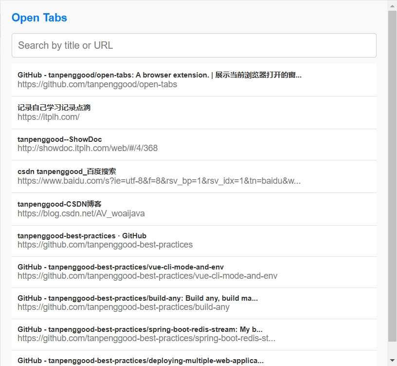

# Open Tabs

A browser extension.

Displays a list of tabs opened by the browser, including the title and URL, and jump to the corresponding tab when click the item.

展示浏览器打开的窗口列表，包含标题和网址，点击可以跳转到对应的标签页。

## 效果图

